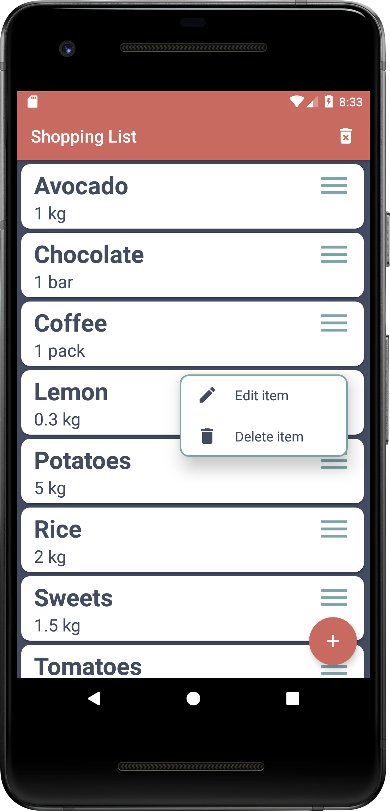

# ShoppingList
ShoppingList created in Android Studio

Click on FloatingActionButton to Add item.

Click on ImageView Menu icon for PopupMenu Edit item and Delete item.

Click on menu Delete icon to delete all notes.

Room database and MVVM.

   

   
